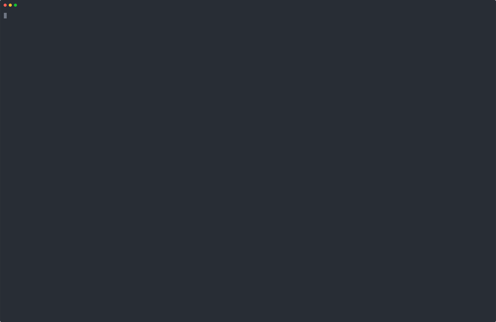

# Sammy's science house data

Reverse engineering of 1994 Sammy's science house data files **(.RES)**.


## Assets extractor

Create an output folder
```bash
mkdir out && cd out
```

Build the extractor
```bash
g++ ../src/main.cpp -o extract
```

Extract
